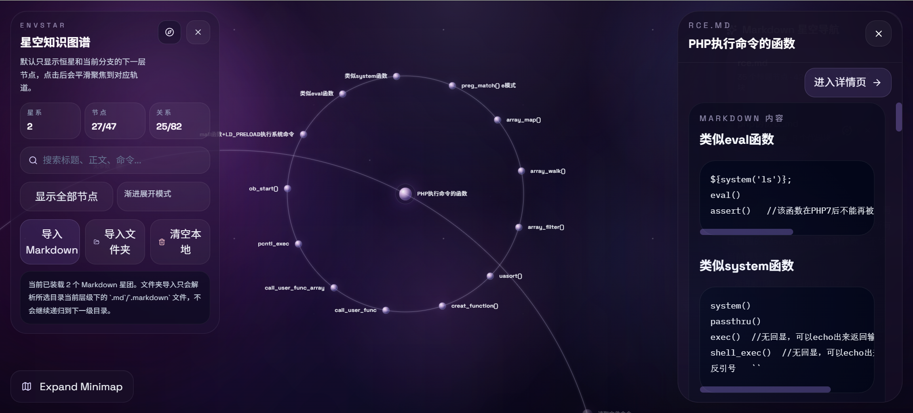

# Envstar

<p align="center">
  一个把 Markdown 技术笔记映射成星系知识图谱的前端原型。
</p>

<p align="center">
  
  
  
  
  
</p>

<p align="center">
  
  
  
  
</p>

## 简介

Envstar 是一个面向技术知识整理、CTF 笔记浏览和 Markdown 内容探索的星图式知识图谱原型。

它不是传统笔记列表，也不是树状思维导图，而是把一个或多个 Markdown 文件转换成多个“星系”:

- 文件名作为恒星
- 一级标题作为行星
- 更深层级标题继续作为卫星向外环绕
- 用户可以通过缩放、拖拽、搜索、小地图和节点聚焦来探索整张知识宇宙

当前版本聚焦于前端原型体验，重点放在：

- 星空式图谱浏览
- Markdown AST 解析
- 渐进式节点展开
- 多文档星系布局
- 节点详情与全文阅读

## 目录

- [功能特性](#功能特性)
- [界面预览](#界面预览)
- [技术栈](#技术栈)
- [快速开始](#快速开始)
- [使用方式](#使用方式)
- [Markdown 解析规则](#markdown-解析规则)
- [项目结构](#项目结构)
- [开发命令](#开发命令)
- [路线图](#路线图)
- [常见问题](#常见问题)
- [贡献](#贡献)
- [License](#license)

## 功能特性

- 星空式知识图谱主视图，支持缩放、拖拽、平移
- 多个 Markdown 文件可同时导入，并以多个独立星系展示
- 默认首次启动时自动加载内置 `rce.md`
- 支持单文件导入和文件夹导入
- 文件夹导入仅解析当前目录中的 `.md` / `.markdown` 文件，不递归子目录
- Markdown 标题层级自动映射为恒星 / 行星 / 卫星结构
- 默认采用渐进式节点展开，避免整张图一次性过载
- 节点详情支持正文、代码块、命令示例等技术内容展示
- 全局搜索支持匹配标题、路径、标签、命令和正文
- 小地图支持定位、放大、收起、拖动位置
- 已导入星团支持单独删除
- 浏览器本地持久化，刷新后可恢复导入内容

## 界面预览




## 技术栈

- React 19
- TypeScript
- Vite
- Tailwind CSS v4
- Motion for React
- React Router
- unified / remark
- react-markdown
- idb-keyval
- Vitest

## 快速开始

### 环境要求

- Node.js 20+
- npm 10+

### 安装依赖

```bash
npm install
```

### 启动开发环境

```bash
npm run dev
```

### 生产构建

```bash
npm run build
```

### 本地预览

```bash
npm run preview
```

## 使用方式

### 1. 默认加载

当浏览器本地还没有已保存文档时，应用会自动载入内置的 `rce.md` 作为默认示例星图。

### 2. 导入单个 Markdown 文件

点击 `导入 Markdown`，可以选择一个或多个 `.md` / `.markdown` 文件。

### 3. 导入整个文件夹

点击 `导入文件夹` 后，应用会读取所选文件夹当前层级中的 Markdown 文件：

- 会导入当前目录中的 `.md` / `.markdown`
- 不会递归进入下一级目录
- 非 Markdown 文件会被自动忽略

### 4. 浏览知识星图

- 点击节点可聚焦当前节点
- 默认只展开当前路径附近的下一层节点
- 右侧详情面板展示该节点的正文和技术内容
- 可通过全局搜索快速定位到相关节点
- 可通过小地图快速跳转视野位置

## Markdown 解析规则

- 每个 Markdown 文件都会生成一个根节点，名称为文件名
- 标题层级会自动归一化
- 即使文档从 `##` 开始，也会被映射成第一层开始的结构
- 代码块中的 `#` 不会被误识别为标题
- 节点详情内容范围为：
  当前标题下，直到下一个同级或更高层标题之前的全部内容

## 项目结构

```text
src/
  app/
    providers/          # 全局状态与本地持久化
    routes/             # 页面入口与主图谱页面
  features/
    graph/              # 图谱布局、渲染、minimap、几何逻辑
    markdown/           # 文件导入、Markdown 解析、存储
    node-detail/        # 节点详情抽屉与详情内容展示
    search/             # 全局搜索
  shared/
    lib/                # 通用工具函数
    sample-data/        # 默认示例数据
    types/              # 类型定义
```

## 开发命令

```bash
# 开发模式
npm run dev

# 生产构建
npm run build

# 预览构建结果
npm run preview

# 运行测试
npm run test

# 测试监听模式
npm run test:watch

# 代码检查
npm run lint
```

## 路线图

- [x] Markdown 转星图节点
- [x] 多文档星系导入
- [x] 渐进式节点展开
- [x] 全局搜索
- [x] 小地图定位
- [x] 本地持久化
- [ ] 节点编辑能力
- [ ] 自定义标签与元信息
- [ ] 更完整的图谱过滤器
- [ ] 导出 / 分享能力
- [ ] 后端同步或协作模式

## 常见问题

### 为什么文件夹导入后没有读取子目录中的 Markdown？

这是当前版本的设计选择。文件夹导入只读取所选目录的当前层级，不会递归进入下一层目录。

### 为什么刷新后文档还在？

因为当前版本会把导入的 Markdown 持久化到浏览器本地存储中，方便继续浏览。

### 为什么构建时会看到 chunk size warning？

这是当前原型阶段的体积提示，不影响正常使用。后续如果继续工程化，可以再做分包优化。


## 贡献

欢迎提出 Issue、功能建议和界面改进意见。

如果你准备提交 PR，建议：

1. 先开一个 issue 或讨论说明改动目标
2. 保持改动范围聚焦
3. 在提交前运行 `npm run build` 和 `npm run test`
